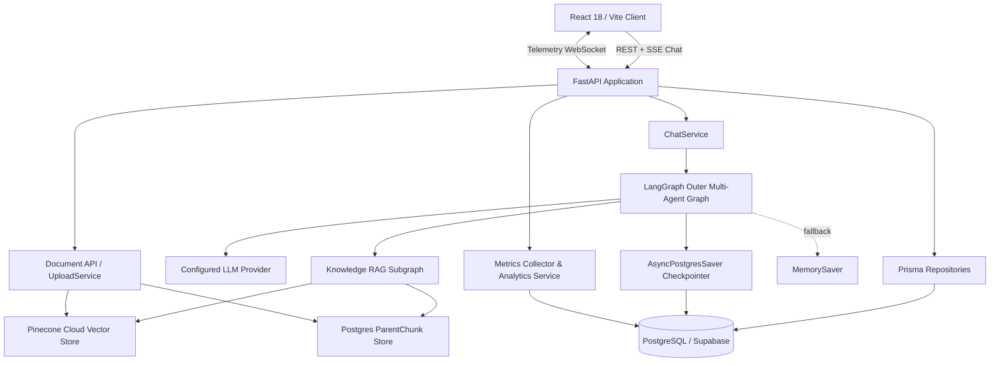
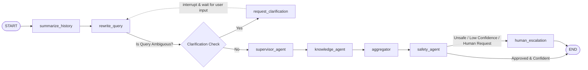
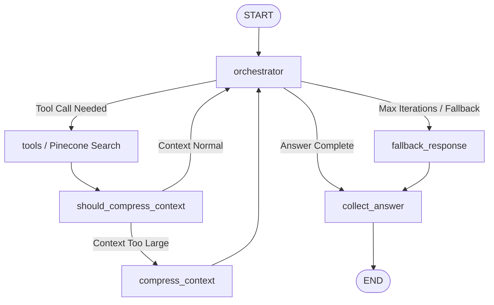
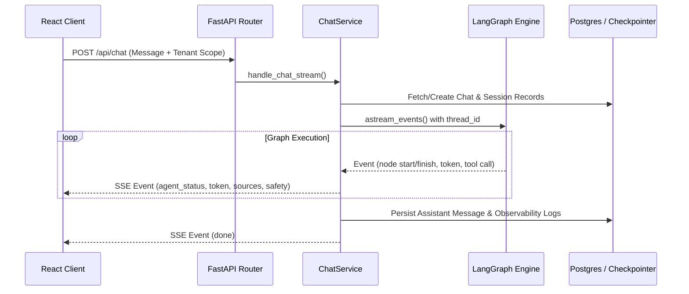
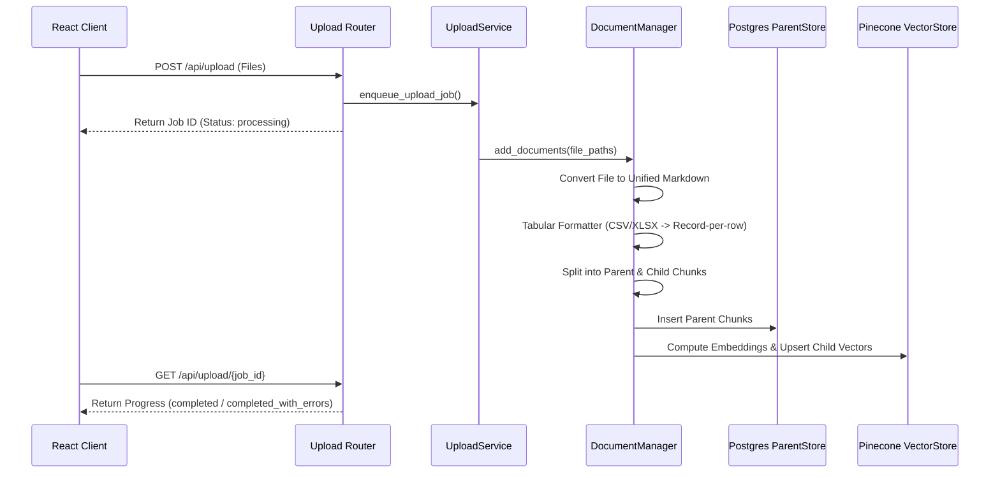
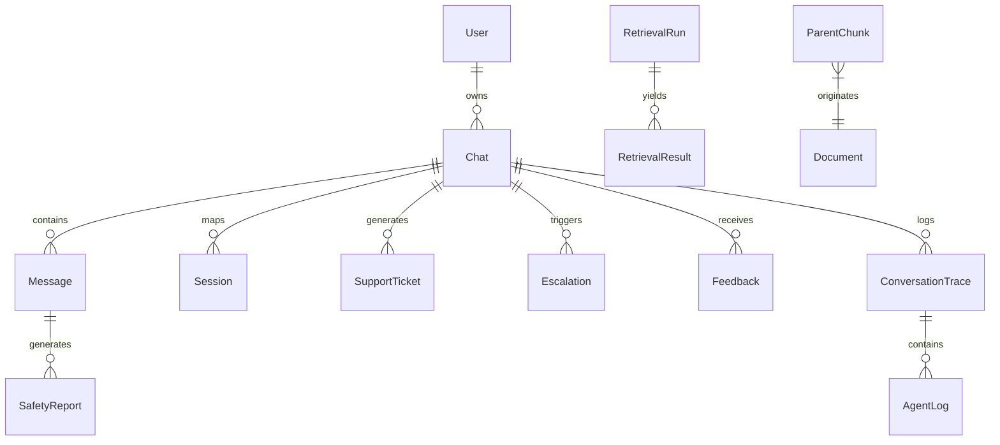

# Agentic RAG Support Desk — Architecture Analysis

> **Scope:** Current repository implementation  
> **Updated:** July 2026

---

## 1. System Overview

The **Agentic RAG Support Desk** is a full-stack, enterprise-grade customer support platform. It integrates a React frontend with a FastAPI backend, orchestrated by a multi-agent **LangGraph** workflow. The system combines high-speed vector search (Pinecone) with durable document context storage (PostgreSQL `ParentChunk` table) to deliver grounded, streaming customer support answers.

---

## 2. Module Boundaries & Layering

| Layer | Modules / Files | Primary Responsibilities |
| --- | --- | --- |
| **User Interface** | `frontend/src/` | Auth state, chat streaming UI, document uploads, admin metrics dashboard, prompt versioning, execution trace viewer. |
| **HTTP & Routing** | `backend/app.py`, `backend/api/routers/` | FastAPI application lifespan, CORS middleware, route validation, request latency tracking, authentication dependencies, SSE adaptation. |
| **Service Layer** | `backend/services/` | `ChatService` (SSE event streaming & graph execution), `UploadService` (async document ingestion jobs), `MetricsCollector`, `AnalyticsService`. |
| **Graph Orchestration** | `project/rag_agent/`, `project/agents/` | Multi-agent state machine (`State`, `AgentState`), intent classification (`supervisor_agent`), RAG execution (`knowledge_agent`), response synthesis (`aggregator`), safety verification (`safety_agent`), automated handoff (`human_escalation`). |
| **Retrieval Engine** | `project/core/`, `project/db/`, `project/vector/` | Document chunking (`DocumentChunker`), parent-child document manager (`DocumentManager`), Pinecone vector store wrappers (`PineconeVectorStoreManager`), parent chunk store (`ParentStoreManager`). |
| **Persistence Repositories** | `project/repositories/`, `project/schema.prisma` | Prisma ORM repositories managing 13+ relational models for users, chats, messages, support tickets, escalations, feedback, traces, and metrics. |
| **Enterprise & Governance** | `project/enterprise/` | Multi-tenant context management (`TenantContext`), Cohere/BGE reranking, trace recording, cost calculation. |

### System Bootstrapping (`backend/bootstrap.py`)
Prior to importing any submodules, `backend/bootstrap.py` is invoked to:
1. Load environment variables from `project/.env`.
2. Append the `project/` directory to `sys.path`.
3. Apply `WindowsSelectorEventLoopPolicy` on Windows systems to prevent async loop collisions.

---

## 3. LangGraph Architecture & Graph Design

The application utilizes a two-tier LangGraph architecture consisting of an **Outer Governance Graph** and an **Inner RAG Retrieval Subgraph**.

### 3.1 Outer Governance Graph

#### Node Breakdown:

1. **`summarize_history`**: Examines incoming conversation state. If message history exceeds configured token thresholds, older conversation turns are summarized into `conversation_summary`, maintaining state context while controlling prompt length.
2. **`rewrite_query`**: Analyzes the original query alongside history summary to generate clear, standalone search questions (`rewrittenQuestions`).
3. **`request_clarification`**: If the query is ambiguous, the node sets `clarification_needed=True` and triggers a LangGraph `interrupt`. The graph pauses, returning an SSE `clarification` event. Upon receiving the user's clarifying reply, `ChatService` resumes execution.
4. **`supervisor_agent`**: Classifies query intent and verifies operational boundaries. Routes execution directly to the `knowledge_agent`.
5. **`knowledge_agent`**: Wraps and executes the inner tool-using RAG subgraph for each rewritten query.
6. **`aggregator`**: Synthesizes and merges output answers from retrieval runs into a coherent response.
7. **`safety_agent`**: Evaluates synthesized responses for hallucinations, safety violations, prompt injections, or policy rejections.
8. **`human_escalation`**: Triggered when safety checks fail, confidence is `< 0.60`, retrieval yields errors, or the user explicitly requests human assistance. Formats a structured escalation ticket and hands off the interaction.

---

### 3.2 Inner Knowledge RAG Subgraph

The `knowledge_agent` node instantiates and invokes an inner tool-using subgraph (`agent_subgraph`):

- **`orchestrator`**: Bound to Pinecone document retrieval tools (`kb_tool`). Executes tool calls iteratively to collect relevant document snippets.
- **`compress_context`**: If tool outputs exceed token limits, this node dynamically compresses context before re-prompting the orchestrator.
- **`collect_answer`**: Aggregates gathered document chunks into a structured output containing the answer text and source citations.

---

## 4. Chat & Streaming Architecture

The streaming pipeline delivers real-time updates via Server-Sent Events (SSE):

### SSE Event Specification

- `session`: Emitted on stream start with `session_id` and `chat_id`.
- `agent_status`: Emitted when graph nodes transition (e.g., `supervisor_agent`, `knowledge_agent`).
- `clarification`: Emitted when graph interrupts for user input.
- `tool_call` / `tool_result`: Details tool execution parameters and returned chunk metadata.
- `token`: Streams final customer-facing answer text tokens in real time (emitted exclusively by final response nodes: `aggregator` and `human_escalation`).
- `sources`: Emitted with unique document source titles and chunk IDs used in answer synthesis.
- `safety`: Delivers safety check score and approval status.
- `final` / `done`: Signals stream completion with metadata.
- `error`: Transmits exception details if execution fails.

---

## 5. Document Ingestion & Retrieval Pipeline

### 5.1 Document Conversion & Tabular Handling
- **Standard Documents (PDF, DOCX, PPTX, TXT, MD):** Converted to Markdown using `MarkItDown` and `PyMuPDF4LLM`. Originals are stored under `knowledge_base/`, and generated Markdown is retained under `markdown_docs/` for reindexing.
- **Tabular Documents (CSV, XLSX, XLS):** Converted to one `## Record N` section per row with `- **Column**: Value` pairs. This avoids pipe-table header loss during chunking and ensures every child vector chunk carries complete column metadata.

### 5.2 Ingestion Guardrails & Atomic Rollbacks
- **File Size Cap:** 25 MiB per file.
- **Chunk Ceiling Guardrail:** Enforces `MAX_CHILD_CHUNKS_PER_DOCUMENT` (default 20,000). If a file exceeds this chunk threshold, ingestion aborts immediately to prevent CPU embedding hangs.
- **Atomic Rollback:** If vector embedding fails after parent chunks have been inserted into PostgreSQL, `DocumentManager` executes an automatic deletion of inserted `ParentChunk` records.
- **Job Status:** Jobs track per-file success and error details. If part of a batch fails, the job reports `completed_with_errors` rather than false success.

### 5.3 ParentStore Manager Strategy
`ParentStoreManager` initializes its backend strategy (**PostgreSQL database** vs **Local JSON file system**) once per process:
- When `CLOUD_BACKEND_ENABLED=true` and PostgreSQL is accessible, parent chunks are saved to the `parent_chunks` database table.
- When offline or database is disabled, parent chunks fall back to `parent_store/<source_name>.json`.

---

## 6. Persistence & Relational Data Model

The database schema (`project/schema.prisma`) defines 13+ relational models grouped into logical domains:

### Model Domain Overview

1. **Identity & Conversation:** `User`, `Chat`, `Message`, `Session`, `ConversationSummary`.
2. **Support Governance:** `SupportTicket`, `Escalation`, `Feedback`, `SafetyReport`.
3. **Observability & Analytics:** `AgentLog`, `ConversationTrace`, `RetrievalRun`, `RetrievalResult`, `CostUsage`.
4. **Administration & Lifecycle:** `PromptVersion`, `EvaluationDataset`, `EvaluationRun`.
5. **Operations:** `ParentChunk`, `AnalyticsEvent`, `AgentMetric`, `SystemMetric`, `SecurityEvent`.

### LangGraph Checkpointer State Machine
- **Primary:** `AsyncPostgresSaver` utilizing `psycopg3` connection pool (`AsyncConnectionPool`) against PostgreSQL/Supabase. Handles connection string normalization (e.g., stripping `pgbouncer` parameters).
- **Fallback:** `MemorySaver` provides transient in-memory state checkpointing when database connectivity is unavailable.

---

## 7. Multi-Tenancy, Security & Governance

### 7.1 Multi-Tenant Context (`TenantContext`)
When `TENANCY_ENABLED=true`, request-level isolation is enforced via Python `ContextVar`:
- Incoming request scope parameters (`tenant_id`, `department_id`, `project_id`) construct a request-local `TenantContext`.
- Vector retrieval searches and document indexing operations derive Pinecone namespaces and metadata filters directly from `TenantContext`.

### 7.2 Security & Access Controls
- **API Authentication:** Bearer token headers verified against Supabase Auth / JWT.
- **Resource Ownership:** Chat history retrieval and deletion endpoints enforce ownership validation against the authenticated `user_id`.
- **Admin Endpoints:** Enterprise trace replays, prompt version creation, and cost telemetry require `require_admin` authorization.

---

## 8. Deployment Topology

| Deployment Mode | API Listening Port | Configuration Source | Execution Characteristics |
| --- | ---: | --- | --- |
| **Local Development** | `8001` | `project/.env` | FastAPI started via `python -m backend.main`. Vite proxies `/api` requests to port 8001. |
| **Docker Compose API** | `8000` | Root `.env` | Containerized API server. Health check queries `/api/live`. |
| **Docker Compose UI** | `5173` | Mounted Volume | Alpine-based Node dev server with hot reloading. |

---

## 9. Constraints & Recommended Improvements

1. **Embedding Throughput:** Local CPU embedding generation runs at ~0.3 to 80 chunks/sec depending on model selection (`Qwen/Qwen3-Embedding-0.6B` vs `BAAI/bge-small-en-v1.5`). Production deployments should utilize GPU acceleration or hosted embedding APIs.
2. **Pinecone Index Lifecycle:** Metadata-filter deletion availability varies across Pinecone index tiers. Operators should perform full corpus reindexes when changing vector index schemas.
3. **Tenant Ingestion Alignment:** Ensure documents ingested in multi-tenant environments carry explicit tenant scope metadata during upload to maintain isolation boundaries.
