# Agentic RAG Support Desk — How It Is Built

> **Covers:** the code as it stands in this repository
> **Updated:** July 2026

Every diagram below is drawn from the current code. They are grouped so you can start wide and zoom in.

### Diagram index

| # | Diagram | Type | Answers |
| --- | --- | --- | --- |
| 1 | [System context](#1-system-context) | flowchart | Who uses it, what it depends on |
| 2 | [Layers](#2-the-layers) | flowchart | What each layer is responsible for |
| 2.1 | [Architecture Pipelines](#21-end-to-end-system-architecture-pipelines) | flowchart ×4 | High-level data and request flows across the core system |
| 2.2 | [UML Diagrams Suite](#22-unified-modeling-language-uml-suite) | UML ×4 | Standard UML Use Case, Component, Activity, and Package diagrams |
| 3 | [Module map](#3-module-map) | flowchart | Which package imports which |
| 4 | [Main classes](#4-main-classes) | class | What the key objects are and how they connect |
| 5 | [Startup](#5-startup-sequence) | sequence | What happens when the server boots |
| 6 | [Degradation & Fallbacks](#6-what-happens-when-things-are-down) | flowchart ×2 | What breaks, what keeps working, and LLM fallback routing |
| 7 | [Outer graph](#71-the-outer-graph) | flowchart | The conversation workflow |
| 8 | [Inner graph](#72-the-inner-search-graph) | flowchart | The search loop |
| 9 | [Escalation rules](#73-when-a-chat-is-escalated) | flowchart | Why a chat goes to a human |
| 10 | [Conversation lifecycle](#74-conversation-lifecycle) | state | The pause-and-resume states |
| 11 | [Graph state](#75-what-the-state-holds) | class | The fields the workflow carries |
| 12 | [Chat streaming](#81-a-normal-turn) | sequence | How the answer reaches the browser |
| 13 | [Clarification](#82-a-paused-turn-and-its-resume) | sequence | How a paused chat resumes |
| 14 | [Event timeline](#83-event-order-for-one-turn) | sequence | Which event fires when |
| 15 | [Login](#9-login-and-access) | sequence | How a request is authorised |
| 16 | [Upload](#101-the-upload-sequence) | sequence | What happens to an uploaded file |
| 17 | [Chunk pipeline](#102-from-file-to-vector) | flowchart | How a file becomes searchable |
| 18 | [Job states](#103-upload-job-states) | state | The states an upload job passes through |
| 19 | [Reindexing & Deletion](#104-reindexing) | flowchart | How index rebuilds work and handling deletion limits |
| 20 | [Retrieval](#11-the-retrieval-pipeline) | flowchart | How a question finds an answer |
| 21 | [ER diagrams & Tracing](#12-the-database) | ER ×5, flowchart | Database tables, links, and telemetry event flows |
| 22 | [Deployment](#13-where-it-runs) | flowchart | How it runs locally and in Docker |
| 23 | [Safety checks](#141-the-five-checks) | flowchart | How an answer is judged before it is sent |
| 24 | [Tenant isolation](#142-tenant-isolation) | flowchart | How one customer's documents stay separate |

38 diagrams in total. Every one is checked against the mermaid parser, so they all render on GitHub.

---

## 1. System context

Who talks to the system, and what it needs from outside.

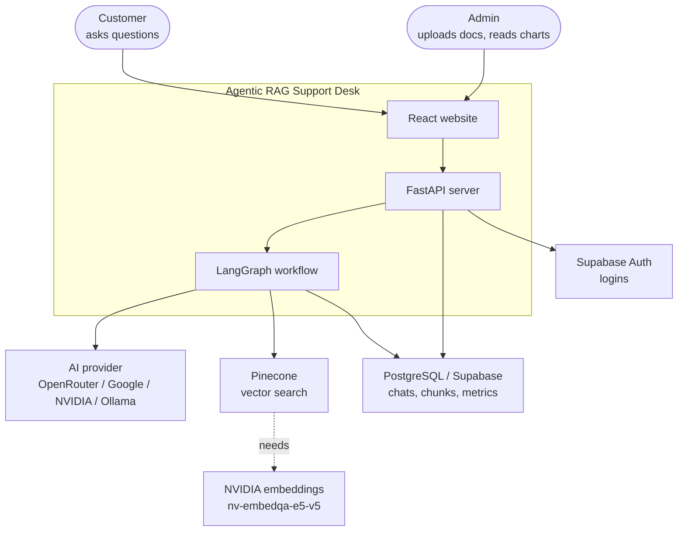

The system never answers from the AI's own memory. Every answer is built from documents you supplied, and when those are not enough the chat goes to a person.

---

## 2. The layers

```mermaid
flowchart TB
    subgraph L1["Browser"]
        direction LR
        Pages["Pages<br/>Chat, Admin, Login, Profile"]
        Hooks["Hooks<br/>useChatStream, useAuth, useDocuments"]
        Lib["lib<br/>axios client, SSE reader, Supabase"]
    end

    subgraph L2["HTTP layer — backend/api"]
        direction LR
        Routers["Routers<br/>health, auth, chat, documents,<br/>feedback, analytics, enterprise"]
        Deps["dependencies.py<br/>auth checks, shared objects"]
        Mw["Middleware<br/>CORS, errors, request timing"]
    end

    subgraph L3["Service layer — backend/services"]
        direction LR
        ChatSvc["ChatService<br/>runs graph, emits events"]
        UpSvc["UploadService<br/>background jobs"]
        Other["AuthService, ConversationService,<br/>AnalyticsService, MetricsCollector"]
    end

    subgraph L4["Workflow — project/rag_agent + project/agents"]
        direction LR
        Graph["graph.py<br/>builds both graphs"]
        Nodes["nodes.py, edges.py<br/>steps and routing"]
        Agents["supervisor, aggregator,<br/>safety, escalation"]
    end

    subgraph L5["Engine — project/core, db, vector, embeddings"]
        direction LR
        RagSys["RAGSystem"]
        DocMgr["DocumentManager"]
        Stores["VectorDbManager,<br/>ParentStoreManager"]
    end

    subgraph L6["Storage"]
        direction LR
        PineDB[("Pinecone")]
        PgDB[("PostgreSQL")]
        Json[("parent_store/*.json<br/>offline fallback")]
    end

    L1 -->|"REST + SSE"| L2
    L2 --> L3
    L3 --> L4
    L4 --> L5
    L5 --> L6
```

Each layer only talks to the one below it. That is why the workflow in `project/` can be used from a script with no FastAPI involved.

---

## 2.1 End-to-End System Architecture Pipelines

These four end-to-end pipeline diagrams visualize how data, requests, security, and search loops flow through the system.

### Pipeline 1: Query & Answering Pipeline

Shows how a user question moves from the frontend to state lookup, multi-query expansion, RAG search, safety validation, and response streaming or ticket escalation.

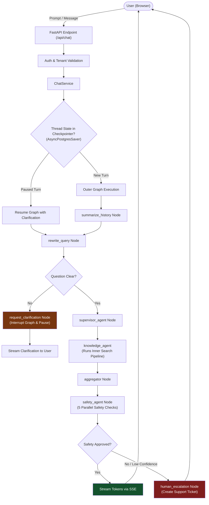

### Pipeline 2: Document Ingestion & Indexing Pipeline

Shows how uploaded documents (PDF, DOCX, CSV, Excel, Markdown) are converted, chunked into parent/child pairs, and indexed across PostgreSQL and Pinecone.

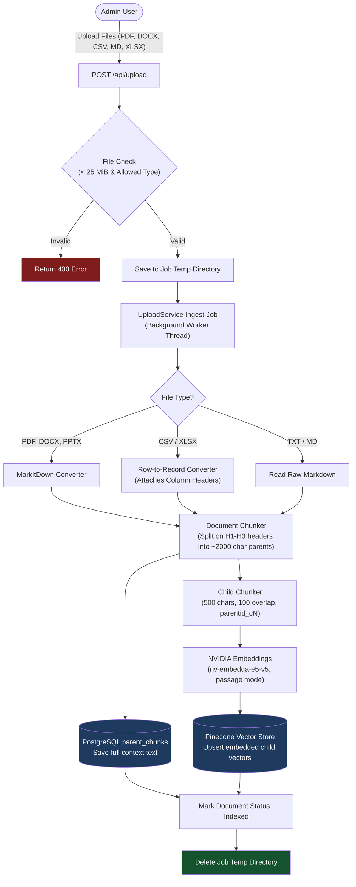

### Pipeline 3: Multi-Agent RAG Search Loop Pipeline

Shows the inner search graph loop, vector search with score filtering, cross-encoder re-ranking, parent context retrieval, and context compression when limits trip.

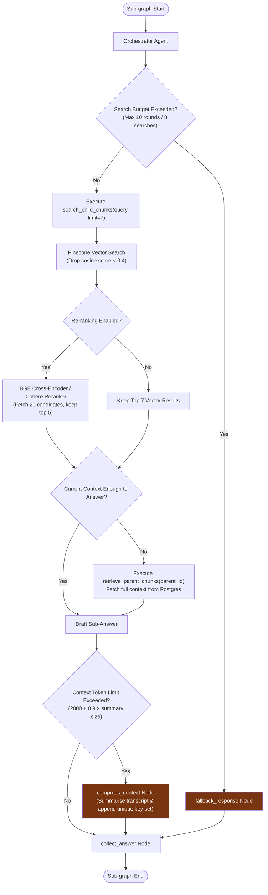

### Pipeline 4: Authentication & Tenant Isolation Pipeline

Shows how request authorization, guest sessions, Python ContextVar tenant propagation, and tenant metadata filtering enforce isolation across DB queries and Pinecone namespaces.

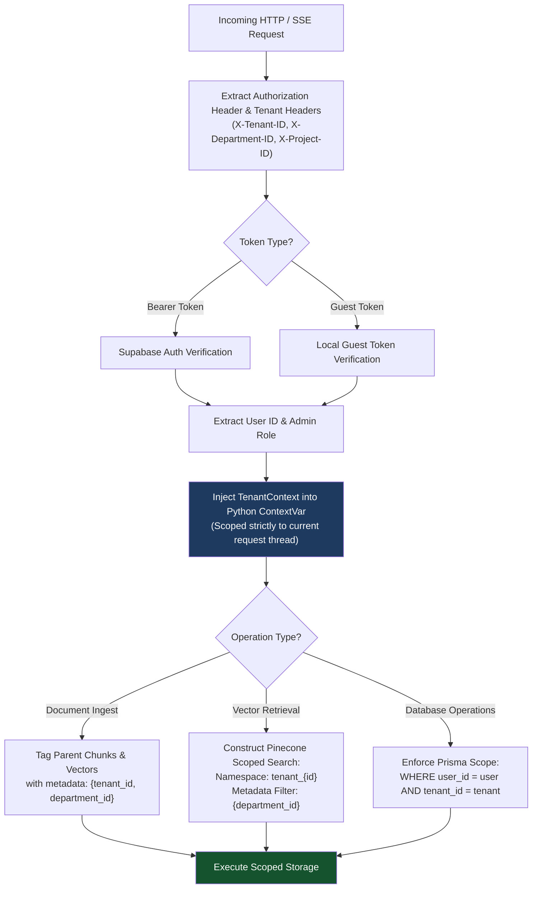

---

## 2.2 Unified Modeling Language (UML) Suite

Standard UML diagrams detailing Use Cases, System Components, Execution Activity, and Package Structure.

### UML Use Case Diagram

Models system actors (Customer, Admin User, AI Agent) and system interactions.

```mermaid
flowchart LR
    subgraph Actors
        Customer["👤 Customer"]
        Admin["👤 Admin User"]
        AI["🤖 System AI Agent"]
    end

    subgraph UseCases["Agentic RAG Support Desk — Use Cases"]
        UC1("(UC-1: Ask FAQ Question)")
        UC2("(UC-2: Provide Turn Clarification)")
        UC3("(UC-3: Stream Response Tokens)")
        UC4("(UC-4: Trigger Human Escalation)")
        UC5("(UC-5: Upload Documents)")
        UC6("(UC-6: Reindex Vector Database)")
        UC7("(UC-7: Monitor Metrics & Traces)")
        UC8("(UC-8: Conduct 5 Safety Checks)")
    end

    Customer --> UC1
    Customer --> UC2
    Admin --> UC5
    Admin --> UC6
    Admin --> UC7

    UC1 ..> UC8 : <<include>>
    UC1 -.-> UC2 : <<extend>>
    UC8 -.-> UC4 : <<extend>>
    AI --> UC3
    AI --> UC4
    AI --> UC8
```

### UML Component Diagram

Visualizes major software components, interfaces, and physical runtime dependencies.

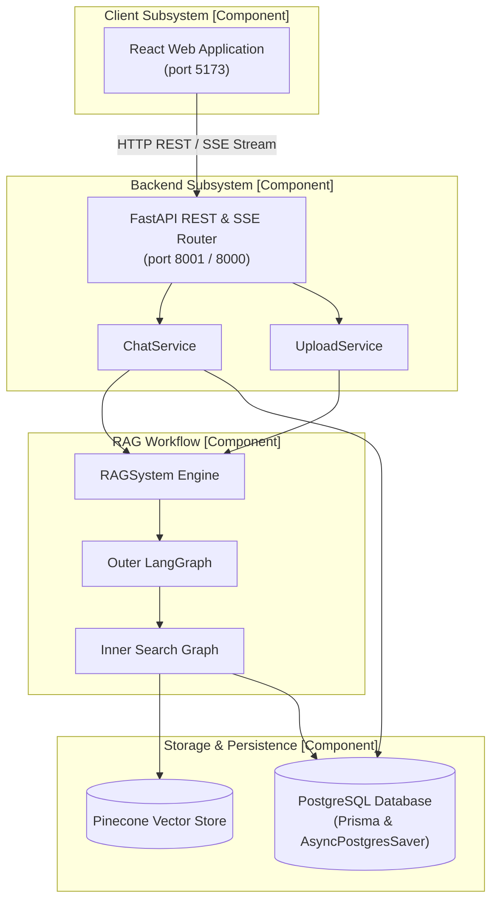

### UML Activity Diagram

Tracks control flow token movement, decision branching, and pause-resume states.

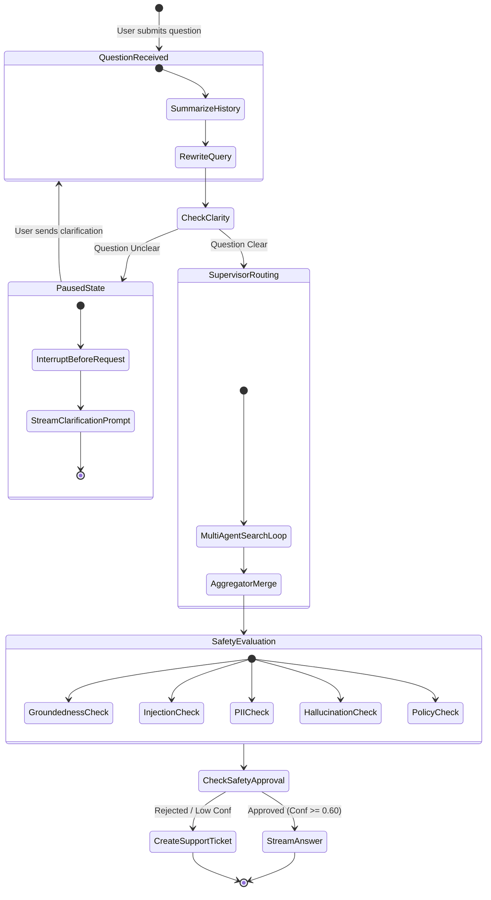

### UML Package Diagram

Maps namespace visibility, code ownership, and architectural layer boundaries.

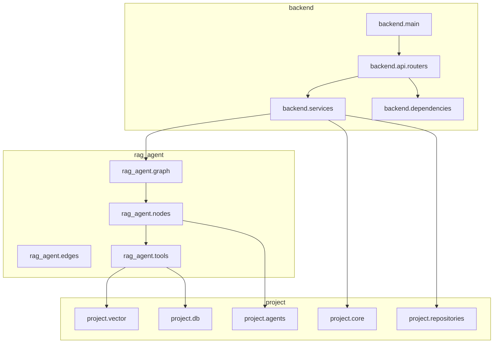

---

## 3. Module map

Which Python package depends on which. Arrows point from the importer to the imported.

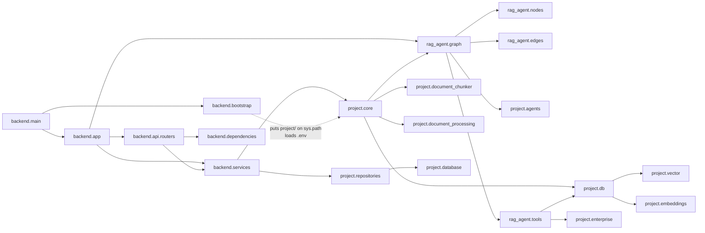

`bootstrap` is the odd one out: it imports nothing from `project/`, but nothing in `project/` works until it has run. Modules there use bare imports like `import config`, which only resolve after `project/` is added to `sys.path`.

---

## 4. Main classes

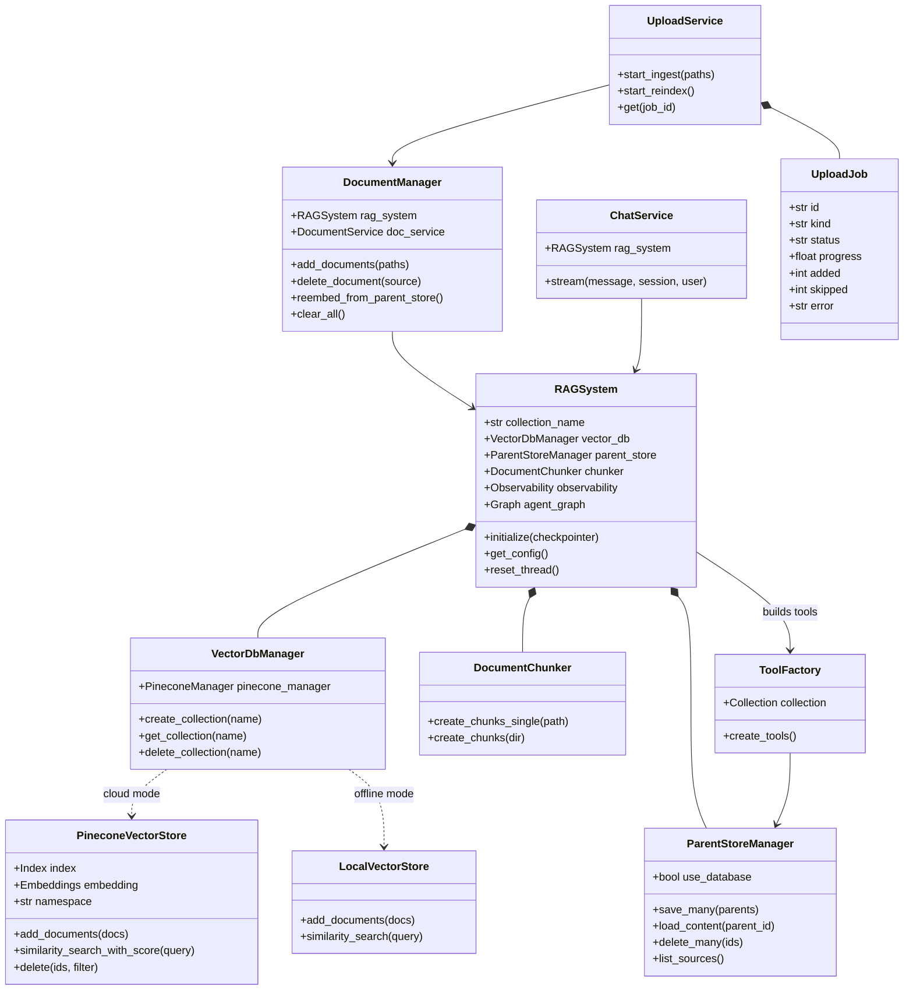

`VectorDbManager` is the swap point. `CLOUD_BACKEND_ENABLED` decides whether it hands back a real `PineconeVectorStore` or the offline `LocalVectorStore`, and nothing above it notices the difference.

---

## 5. Startup sequence

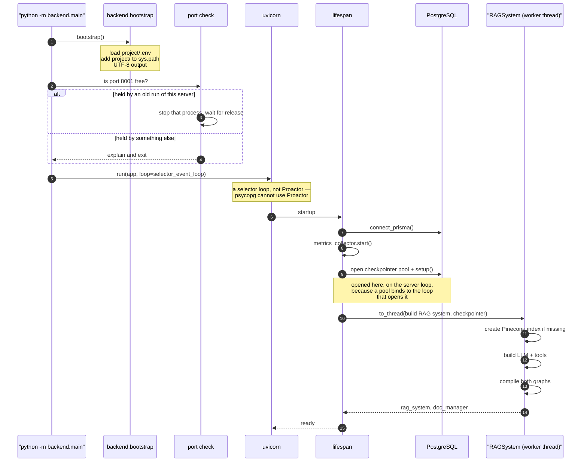

A healthy boot prints exactly this:

```
Port 8001 is held by an earlier run of this server (PID ...); stopping it.   ← only if needed
Connected to Postgres checkpointer.
Compiling agent graph...
Multi-Agent Support Desk graph compiled successfully.
INFO:     Application startup complete.
```

Three things have to line up for the checkpointer pool to open, and each one used to fail silently:

1. **The pool is built closed and opened later.** An `AsyncConnectionPool` binds to whichever loop opens it. The RAG system is built in a worker thread with no running loop, so the pool is created with `open=False` there and opened by the lifespan on the server's own loop.
2. **The server loop must be a selector loop.** psycopg's async mode refuses to run on Windows' `ProactorEventLoop`, and uvicorn hardcodes exactly that. Setting the event loop *policy* does not help — uvicorn passes a `loop_factory` straight to `asyncio.Runner` and never reads the policy. `backend.main` therefore passes `backend.bootstrap:selector_event_loop`.
3. **The URL must be libpq-clean.** One `DATABASE_URL` feeds both Prisma and psycopg, but Prisma-only parameters (`pgbouncer`, `prepared_statements`, and friends) make psycopg abort with "invalid URI query parameter". `_normalize_conninfo` strips just those and leaves real libpq settings like `sslmode` alone.

---

## 6. What happens when things are down

Nothing here is fatal on its own. This is what you lose in each case.

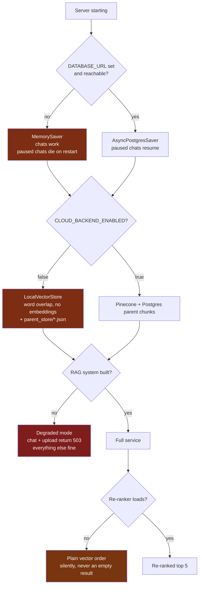

The orange path is the one that quietly hurts answer quality: `CLOUD_BACKEND_ENABLED=false` gives you keyword matching dressed up as semantic search.

### 6.1 AI provider fallback chain

When calling AI models (e.g. OpenRouter free tier), rate limits or provider errors trigger automatic fallback attempts before failing or escalating.

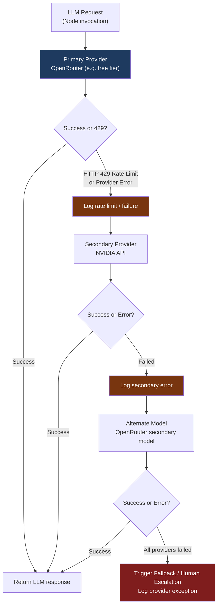

---

## 7. The AI workflow

Two graphs, one inside the other.

### 7.1 The outer graph

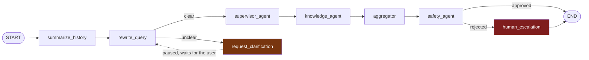

| Node | What it does |
| --- | --- |
| `summarize_history` | Keeps the last 3 plain messages, merges older ones into `conversation_summary`, and resets `agent_answers` so last turn's sources do not leak in. |
| `rewrite_query` | Turns the question plus context into clear standalone search questions — or asks for clarification. |
| `request_clarification` | An empty node. The pause is done by the graph, compiled with `interrupt_before`. |
| `supervisor_agent` | Records the intent. Routing is fixed, so its AI call is skipped by default. |
| `knowledge_agent` | Runs the inner graph once per rewritten question, collecting answers **and** contexts. |
| `aggregator` | Merges the drafts into one reply. Streams to the user. |
| `safety_agent` | Five checks at once; takes the lowest confidence. |
| `human_escalation` | Writes the internal ticket and the short user-facing message. Streams to the user. |

### 7.2 The inner search graph

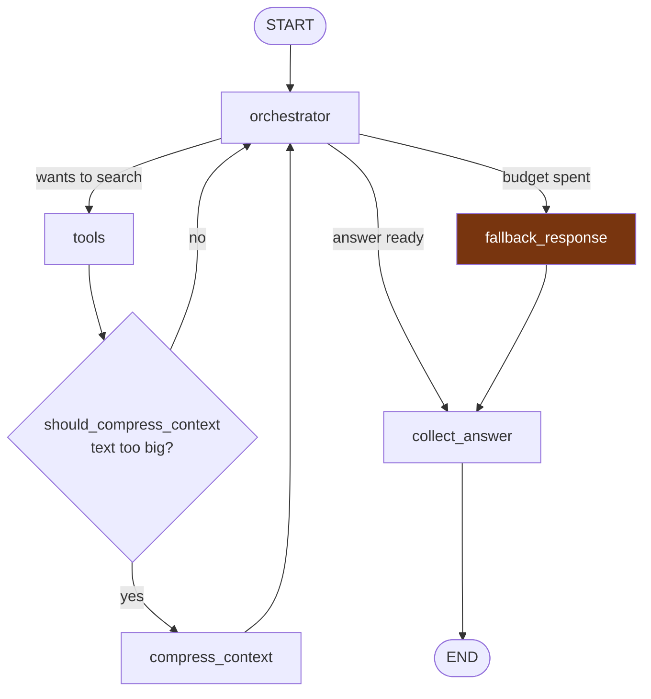

**Two tools, used in order:**

| Tool | Purpose |
| --- | --- |
| `search_child_chunks(query, limit=7)` | Finds short snippets. Returns parent ID, file name, and text. |
| `retrieve_parent_chunks(parent_id)` | Fetches the full chunk behind a snippet, when the snippet is too small to answer from. |

**The budget:** stop after 10 rounds or 8 searches, then fall through to `fallback_response`, which answers from whatever was gathered.

**Compression:** the allowance is `2000 + 0.9 × (current summary size)` tokens, so it grows as the investigation grows. When it trips, the transcript is summarised and replaced, and an "already executed, do NOT repeat" list of parent IDs and past queries is appended — without it the AI re-runs the same searches after losing the transcript.

### 7.3 When a chat is escalated

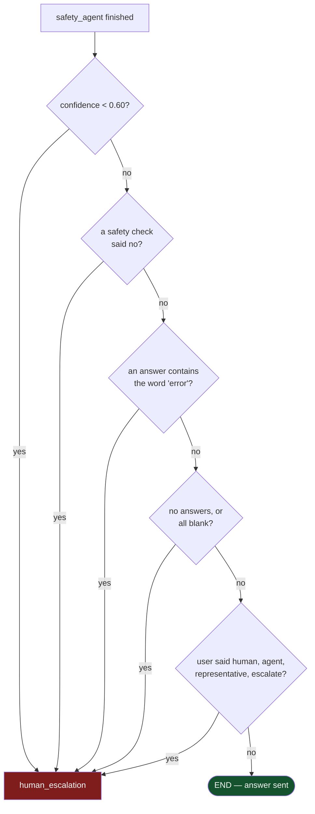

On escalation the user does **not** see the AI's ticket — the answer was often rejected, so repeating it would defeat the point. The ticket goes to `conversation_summary` and the escalations table. The user gets a fixed message plus up to three related topics taken from what the search did find.

### 7.4 Conversation lifecycle

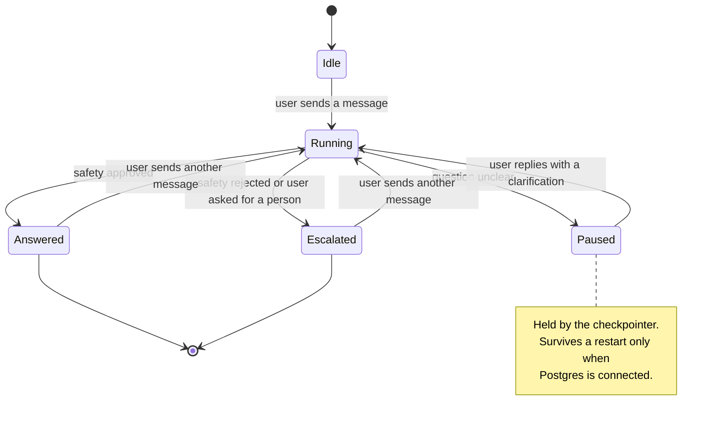

`ChatService` tells these apart with `aget_state(config).next`: if the thread has a next node pending, it is paused and the incoming message is a clarification reply.

### 7.5 What the state holds

The workflow carries two state objects. Most fields are overwritten by whichever node returns them, but a few use a **reducer** so that parallel and repeated steps merge instead of clobbering each other.

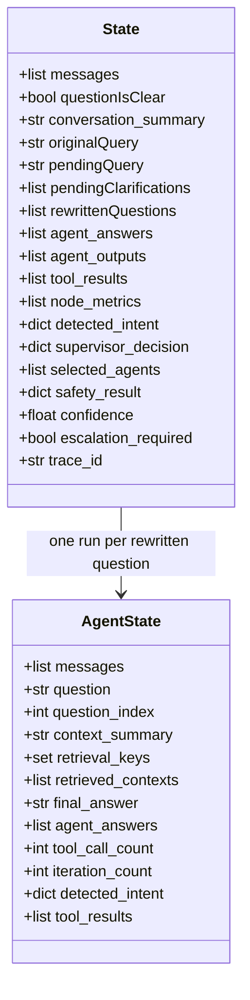

| Reducer | Applies to | Behaviour | Why |
| --- | --- | --- | --- |
| `accumulate_or_reset` | `agent_answers`, `agent_outputs`, `node_metrics` | Appends, unless an item carries `__reset__`, which empties the list | Lets `summarize_history` clear last turn's answers at the start of a new turn |
| `accumulate_tool_results` | `tool_results` | Same append-or-reset behaviour | Tool output from one turn must not leak into the next |
| `set_union` | `retrieval_keys` | Merges sets | Tracks every parent ID and query already used, so compression can say "do not repeat these" |
| `append_unique` | `retrieved_contexts` | Appends, dropping duplicates | Contexts gathered over several rounds stay unique |
| `operator.add` | `tool_call_count`, `iteration_count` | Sums | Counts rounds and tool calls against the budget |

---

## 8. Chat streaming

### 8.1 A normal turn

```mermaid
sequenceDiagram
    autonumber
    participant Client as React
    participant API as "POST /api/chat"
    participant Svc as ChatService
    participant G as LangGraph
    participant DB as Postgres

    Client->>API: message + session_id + tenant scope
    API->>Svc: stream()
    Svc->>DB: create chat, session, user message
    Svc-->>Client: session
    Svc->>G: aget_state — paused?
    Svc->>G: astream(modes: updates + messages)

    loop while running
        G-->>Svc: updates — a node finished
        Svc-->>Client: agent_status
        G-->>Svc: messages — tokens / tool calls
        Svc-->>Client: token / tool_call / tool_result
    end

    Svc->>G: aget_state — final values
    Svc-->>Client: sources
    Svc-->>Client: safety
    Svc-->>Client: final
    Svc->>DB: save answer + metadata, safety report,<br/>analytics, summary
    Svc-->>Client: done
```

**Why two stream modes.** `messages` only surfaces nodes that stream AI text, which left supervisor, knowledge, and safety permanently greyed out in the trace panel. `updates` reports every node that runs, so each step gets a row.

### 8.2 A paused turn and its resume

```mermaid
sequenceDiagram
    autonumber
    participant Client as React
    participant Svc as ChatService
    participant G as LangGraph
    participant CP as Checkpointer

    Note over Client,CP: Turn 1 — the question is too vague
    Client->>Svc: "how do I fix it?"
    Svc->>G: astream(new message)
    G->>G: rewrite_query decides it is unclear
    G-->>Svc: clarification text
    Svc-->>Client: clarification event
    G->>CP: save state, stop before request_clarification
    Svc-->>Client: done

    Note over Client,CP: Turn 2 — the user explains
    Client->>Svc: "the login page"
    Svc->>G: aget_state — next is pending, so this is a reply
    Svc->>G: aupdate_state(messages += reply)
    Svc->>G: astream(None) — resume, no new input
    G->>G: rewrite_query re-runs with the clarification
    G->>G: supervisor → knowledge → aggregator → safety
    Svc-->>Client: token stream, then final
```

The resume works because the whole state sits in the checkpointer. With `MemorySaver` it works within one server run and is lost on restart; with Postgres it survives.

### 8.3 Event order for one turn

```mermaid
sequenceDiagram
    participant S as Server
    participant B as Browser
    S-->>B: session
    S-->>B: agent_status — summarize_history
    S-->>B: agent_status — rewrite_query
    S-->>B: agent_status — supervisor_agent
    S-->>B: tool_call — search_child_chunks
    S-->>B: tool_result — 300-char preview
    S-->>B: tool_call — retrieve_parent_chunks
    S-->>B: tool_result
    S-->>B: agent_status — knowledge_agent
    S-->>B: token, token, token ...
    S-->>B: agent_status — aggregator
    S-->>B: agent_status — safety_agent
    S-->>B: sources
    S-->>B: safety
    S-->>B: agent_status — final
    S-->>B: final
    S-->>B: done
```

| Event | Carries |
| --- | --- |
| `session` | `session_id` |
| `agent_status` | node, title, status, parsed JSON or raw text |
| `clarification` | the question to put to the user |
| `tool_call` / `tool_result` | id, name, args / first 300 chars + truncated flag |
| `token` | answer text — only from `aggregator` and `human_escalation` |
| `sources` | per question: index, question, contexts |
| `safety` | approved, confidence, issues |
| `final` | trace id, full text, confidence, escalation flag, intent |
| `error` | code and message |

A final node emits both its token chunks *and* the complete message it returns, so a whole message repeating what was already streamed is skipped — otherwise the answer prints twice.

---

## 9. Login and access

```mermaid
sequenceDiagram
    autonumber
    participant U as User
    participant W as React
    participant A as "/api/auth/*"
    participant S as Supabase Auth
    participant DB as Postgres

    alt Registered user
        U->>W: email + password
        W->>A: POST /auth/login
        A->>S: verify
        S-->>A: access token + user id
    else Guest
        U->>W: continue as guest
        W->>A: POST /auth/guest
        A->>A: mint a local guest token
    end
    A->>DB: create user row if missing
    A-->>W: token + profile
    W->>W: store token

    Note over W,A: every later call
    W->>A: Authorization: Bearer <token>
    A->>A: get_current_user
    alt admin route
        A->>A: require_admin
    end
    alt owns the conversation?
        A->>DB: chat.userId == caller?
    end
    A-->>W: data, or 401 / 403
```

Admin is the user id `mock-admin-id`, the email `admin@example.com`, or a user row with the admin flag set.

---

## 10. Uploading and indexing

### 10.1 The upload sequence

```mermaid
sequenceDiagram
    autonumber
    participant C as React
    participant R as "POST /api/upload"
    participant S as UploadService
    participant M as DocumentManager
    participant PG as Postgres
    participant PC as Pinecone

    C->>R: files
    R->>R: check type and size (25 MiB)
    R->>R: save to a per-job temp folder
    R->>S: start_ingest()
    R-->>C: job_id, status pending

    S->>M: add_documents() in a worker thread
    loop each file
        M->>M: convert to Markdown
        M->>M: split into parent + child chunks
        M->>M: reject if over the chunk ceiling
        M->>PG: create document row, status indexing
        M->>PG: save parents in batches of 500
        M->>PC: embed in batches of 100, upsert
        M->>PG: mark indexed with the chunk count
    end
    S->>S: delete the temp folder

    loop until finished
        C->>R: GET /api/upload/{job_id}
        R-->>C: progress + current file
    end
```

### 10.2 From file to vector

```mermaid
flowchart TB
    F["Uploaded file"] --> T["Copy to temp folder"]
    T --> D{"file type?"}

    D -->|"PDF, DOCX, PPTX"| MD1["MarkItDown"]
    D -->|"TXT, MD"| MD2["read as-is"]
    D -->|"CSV"| MD3["csv reader<br/>dialect sniffing"]
    D -->|"XLSX, XLS"| MD4["pandas, every sheet"]

    MD3 --> REC["one Record per row<br/>- **Column**: Value"]
    MD4 --> REC

    MD1 --> MDOC["Markdown"]
    MD2 --> MDOC
    REC --> MDOC

    MDOC --> SPECIAL{"MedQuAD or CSV?"}
    SPECIAL -->|yes| FAST["1 row = 1 parent + 1 child<br/>child embeds question + focus<br/>parent holds the full Q and A"]
    SPECIAL -->|no| H["split on headers H1-H3"]

    H --> MERGE["merge parents under 2,000 chars"]
    MERGE --> SPLIT["split parents over 4,000 chars"]
    SPLIT --> BAL["rebalance leftovers"]
    BAL --> CH["children: 500 chars, 100 overlap<br/>id = parentid_cN"]

    FAST --> OUT
    CH --> OUT["parent + child pairs"]

    OUT --> P[("Postgres parent_chunks<br/>full context")]
    OUT --> V[("Pinecone<br/>embedded children")]
    T --> CLEAN["temp folder deleted"]

    style REC fill:#1e3a5f,color:#fff
    style CLEAN fill:#14532d,color:#fff
```

**Why one record per row.** A Markdown pipe table loses its header the moment the chunker splits it, leaving a chunk of bare values that means nothing on its own. One section per row keeps the column names attached to every value.

**Why children get their own id.** Falling back to the parent id would make every child of a parent upsert under the same key and silently overwrite its siblings.

### 10.3 Upload job states

```mermaid
stateDiagram-v2
    [*] --> pending : job created
    pending --> running : worker picks it up
    running --> completed : every file ingested
    running --> completed_with_errors : some files failed
    running --> failed : the whole job threw
    pending --> interrupted : server restarted
    running --> interrupted : server restarted
    completed --> [*]
    completed_with_errors --> [*]
    failed --> [*]
    interrupted --> [*]

    note right of interrupted
        Written to uploads/jobs_registry.json.
        On startup anything still pending or
        running is marked interrupted, so a
        job never appears to hang forever.
    end note
```

**Safety rules during ingest:**

| Rule | Value |
| --- | --- |
| File size | 25 MiB, checked at the router |
| Chunk ceiling | `MAX_CHILD_CHUNKS_PER_DOCUMENT`, 100,000 — bypassed for MedQuAD and CSV |
| Duplicates | skipped by filename |
| Failure | parents already written are deleted, document marked failed |
| Local copies | none — the temp folder is removed whatever happens |

### 10.4 Reindexing

`POST /api/reindex` clears the Pinecone namespace and re-embeds **from the parent chunks in Postgres**, not from files. The parent store is the source of truth; if it is empty, reindexing produces nothing.

This matters for deletion too. Not every Pinecone tier supports delete-by-filter. When it fails, the document is gone from the parent store and the documents table but its vectors remain, so the API returns **501** telling you to reindex.

```mermaid
flowchart TD
    subgraph Reindex["POST /api/reindex"]
        R1["Request reindex"] --> R2["Clear Pinecone namespace"]
        R2 --> R3["Fetch parent chunks from Postgres"]
        R3 --> R4{"Parent chunks exist?"}
        R4 -->|no| R5["Return 0 indexed"]
        R4 -->|yes| R6["Re-create children & re-embed"]
        R6 --> R7["Upsert vectors to Pinecone"]
    end

    subgraph Delete["Delete document"]
        D1["Delete request"] --> D2["Delete parent chunks in Postgres"]
        D2 --> D3["Delete document record in DB"]
        D3 --> D4["Attempt Pinecone delete(filter={source})"]
        D4 --> D5{"Delete-by-filter supported?"}
        D5 -->|yes| D6["Vectors deleted from Pinecone"]
        D5 -->|no / error| D7["Return 501 / Warning:<br/>Parent deleted, reindex required"]
    end

    style R5 fill:#78350f,color:#fff
    style D7 fill:#7f1d1d,color:#fff
```

---

## 11. The retrieval pipeline

```mermaid
flowchart TB
    Q["Rewritten question"] --> E["embed as 'query'<br/>nv-embedqa-e5-v5"]
    E --> N{"tenancy on?"}
    N -->|yes| NS["namespace + metadata filter<br/>from TenantContext"]
    N -->|no| NS2["plain namespace"]
    NS --> S
    NS2 --> S

    S["Pinecone search<br/>cosine, drop score < 0.4"] --> K{"re-ranking on?"}
    K -->|yes| C["fetch 20 candidates"]
    K -->|no| C2["fetch 7"]

    C --> RR["BGE cross-encoder<br/>or Cohere"]
    RR -->|"any failure"| KEEP["keep the vector order"]
    RR --> TOP["keep the best 5"]
    KEEP --> TOP

    C2 --> TOP2["keep 7"]

    TOP --> OUT
    TOP2 --> OUT["snippets:<br/>parent id + file name + text"]

    OUT --> DEC{"enough to answer?"}
    DEC -->|no| PAR["retrieve_parent_chunks<br/>full context from Postgres"]
    DEC -->|yes| ANS["draft the answer"]
    PAR --> ANS

    style KEEP fill:#78350f,color:#fff
```

| Setting | Default | Effect |
| --- | --- | --- |
| `RETRIEVAL_SCORE_THRESHOLD` | 0.4 | Weaker matches dropped |
| `DEFAULT_RETRIEVAL_K` | 7 | Snippets returned to the AI |
| `RETRIEVAL_CANDIDATE_K` | 20 | Fetched before re-ranking |
| `RETRIEVAL_RERANKED_K` | 5 | Kept after re-ranking |
| `RERANKER_PROVIDER` | `bge` | `BAAI/bge-reranker-base`, or `cohere` |

The embedding model is **asymmetric**: documents are embedded as `passage`, queries as `query`. Mixing those up quietly degrades every search. Both re-rankers fail soft — any error returns the original vector ordering rather than nothing.

---

## 12. The database

23 tables. Split by purpose so each diagram stays readable. Names shown are the real Postgres table names.

### 12.1 People and conversations

```mermaid
erDiagram
    users ||--o{ chats : owns
    users ||--o{ sessions : has
    chats ||--o{ messages : contains
    chats ||--o{ sessions : maps
    chats ||--o{ conversation_summaries : summarised_by
    messages ||--o{ safety_reports : checked_by
    chats ||--o{ safety_reports : records

    users {
        string id PK
        string email UK
        string name
        boolean is_admin
        datetime created_at
    }
    chats {
        string id PK
        string user_id FK
        string title
        datetime created_at
    }
    messages {
        string id PK
        string chat_id FK
        string role
        string content
        json metadata "steps, tools, sources, safety"
        datetime timestamp
    }
    sessions {
        string id PK "thread_id"
        string user_id FK
        string chat_id FK
        datetime last_active
    }
    conversation_summaries {
        string id PK
        string chat_id FK
        string summary
        datetime timestamp
    }
    safety_reports {
        string id PK
        string chat_id FK
        string message_id FK
        boolean approved
        float confidence
        json issues
    }
```

`sessions.id` is the LangGraph `thread_id`, and `ChatService` uses the same value for `chat_id` and `session_id`. That is why one conversation is one thread.

### 12.2 Support handling

```mermaid
erDiagram
    users ||--o{ tickets : raises
    users ||--o{ escalations : triggers
    users ||--o{ feedback : gives
    chats ||--o{ tickets : generates
    chats ||--o{ escalations : generates
    chats ||--o{ feedback : receives

    tickets {
        int id PK
        string user_id FK
        string chat_id FK
        string issue
        string status "open"
        string customer_email
    }
    escalations {
        string id PK
        string user_id FK
        string chat_id FK
        string reason
        string status "pending"
    }
    feedback {
        string id PK
        string user_id FK
        string chat_id FK
        int rating
        string comment
    }
```

### 12.3 Tracing and cost

```mermaid
erDiagram
    chats ||--o{ agent_logs : logs

    agent_logs {
        string id PK
        string chat_id FK
        string thread_id
        string node_name
        string event_type
        json payload
        float duration_ms
        string trace_id "by convention"
    }
    conversation_traces {
        string id PK
        string chat_id "no FK"
        string thread_id
        string tenant_id
        string status "running"
        datetime started_at
        datetime ended_at
    }
    retrieval_runs {
        string id PK
        string trace_id "no FK"
        string query
        string namespace
        json filters
        float latency_ms
    }
    retrieval_results {
        string id PK
        string retrieval_run_id "no FK"
        string parent_id
        float vector_score
        float rerank_score
        int original_rank
        int rank
    }
    cost_usage {
        string id PK
        string trace_id "no FK"
        string agent_name
        string model
        int input_tokens
        int output_tokens
        float cost_usd
    }
```

> **Worth knowing:** only `agent_logs` has a real foreign key. The trace, retrieval, and cost tables are joined by `trace_id` / `retrieval_run_id` **by convention only** — the database does not enforce them, and deleting a chat does not cascade into them.

```mermaid
flowchart TB
    subgraph Execution["LangGraph Execution"]
        Node["Agent Node Run"] --> GenID["Generate trace_id & retrieval_run_id"]
    end

    subgraph Logging["Observability Writing"]
        GenID --> AL["agent_logs<br/>FK: chat_id"]
        GenID --> CT["conversation_traces<br/>Trace ID joined"]
        GenID --> RR["retrieval_runs<br/>Trace ID joined"]
        RR --> RES["retrieval_results<br/>retrieval_run_id joined"]
        GenID --> CU["cost_usage<br/>Trace ID joined"]
    end

    subgraph Cleanup["Chat Deletion"]
        DelChat["DELETE /chats/{id}"] --> DBDel["Deletes chat row"]
        DBDel -->|Cascades| AL
        DBDel -. Does NOT cascade .-> CT
        DBDel -. Does NOT cascade .-> RR
        DBDel -. Does NOT cascade .-> RES
        DBDel -. Does NOT cascade .-> CU
    end

    style DelChat fill:#7f1d1d,color:#fff
    style CT fill:#1e3a5f,color:#fff
    style RR fill:#1e3a5f,color:#fff
    style CU fill:#1e3a5f,color:#fff
```

### 12.4 Content

```mermaid
erDiagram
    documents {
        string id PK
        string filename UK
        int chunk_count
        string status "pending, indexing, indexed, failed"
        json metadata "uploaded_by, version"
        datetime created_at
    }
    parent_chunks {
        string id PK "parent_id, e.g. faq_p3"
        string document_id "indexed, no FK"
        string content
        json metadata "source, parent_id, focus_area"
        datetime created_at
    }
```

`parent_chunks.document_id` is indexed but is not a foreign key, so a parent chunk can outlive its document row. `DocumentManager.delete_document` therefore clears both by hand.

### 12.5 Metrics and admin

```mermaid
erDiagram
    analytics_events {
        string id PK
        string event_type "ai_request, escalation_triggered"
        string user_id
        string session_id
        json metadata
    }
    agent_metrics {
        string id PK
        string agent_name
        int requests
        int successes
        int failures
        float avg_exec_time_ms
        float avg_confidence
        int escalations
    }
    system_metrics {
        string id PK
        float cpu_pct
        float mem_pct
        float api_latency_ms
        float db_query_ms
        float vector_search_ms
        float embedding_ms
    }
    security_events {
        string id PK
        string event_type "prompt_injection_blocked"
        string user_id
        string ip
        json metadata
    }
    prompt_versions {
        string id PK
        string key
        int version
        string content
        boolean active
    }
    evaluation_datasets {
        string id PK
        string name UK
    }
    evaluation_runs {
        string id PK
        string dataset_id "no FK"
        string status
        json metrics
        json baseline
    }
```

`prompt_versions` is unique on `(key, version)`.

### 12.6 Tables LangGraph owns

The checkpointer creates and manages its own tables on first `setup()` — `checkpoints`, `checkpoint_writes`, `checkpoint_blobs`, `checkpoint_migrations`. They are not in `schema.prisma` and should not be edited by hand. These are what make a paused conversation resumable.

---

## 13. Where it runs

```mermaid
flowchart TB
    subgraph Dev["Local development"]
        direction TB
        V["Vite dev server :5173"]
        B["python -m backend.main :8001"]
        V -->|"proxy /api"| B
        V -->|"proxy /ws"| B
    end

    subgraph Doc["Docker Compose"]
        direction TB
        FE["frontend<br/>node:20-alpine :5173"]
        AP["api<br/>Dockerfile :8000"]
        FE -->|"depends on healthy"| AP
        AP -->|"healthcheck /api/live<br/>every 30s"| AP
    end

    subgraph Cloud["External"]
        direction LR
        PC[("Pinecone")]
        SB[("Supabase Postgres")]
        AI["AI provider"]
    end

    B --> Cloud
    AP --> Cloud
```

| Mode | API port | Settings from | Notes |
| --- | ---: | --- | --- |
| Local development | 8001 | `project/.env` | Start with `python -m backend.main`, which supplies the selector loop. |
| Docker Compose — API | 8000 | root `.env` | Health check calls `/api/live`. |
| Docker Compose — website | 5173 | mounted volume | Starts only after the API is healthy. |

CORS allows a single origin, `FRONTEND_ORIGIN`, default `http://localhost:5173`.

A middleware times every request into the metrics collector. It catches exceptions from the handler chain and returns a 500 JSON response rather than letting them propagate — otherwise a failed streaming handshake makes Starlette panic with "No response returned."

**Ports:** if 8001 is already held by an earlier run of this same server, startup stops that process and takes the port. Anything else on the port is reported and left alone. `API_PORT` changes the port; `API_PORT_RECLAIM=0` turns the reclaim off.

---

## 14. Safety and tenants

### 14.1 The five checks

```mermaid
flowchart LR
    A["Drafted answer"] --> P{"run in parallel"}
    P --> C1["groundedness<br/>AI"]
    P --> C2["prompt_injection<br/>regex first"]
    P --> C3["pii<br/>regex first"]
    P --> C4["hallucination<br/>AI"]
    P --> C5["policy_compliance<br/>AI"]
    C1 --> M["approved = all five approve<br/>confidence = lowest of the five"]
    C2 --> M
    C3 --> M
    C4 --> M
    C5 --> M
    M --> R{"route_after_safety"}

    style C2 fill:#1e3a5f,color:#fff
    style C3 fill:#1e3a5f,color:#fff
```

Two checks short-circuit on a pattern before spending an AI call: injection phrasing such as "ignore previous instructions", and card- or SSN-shaped numbers in the answer. A flagged injection is also logged as `prompt_injection_blocked` and broadcast at high severity.

### 14.2 Tenant isolation

```mermaid
flowchart LR
    Req["POST /api/chat<br/>tenant_id, department_id, project_id"] --> TC["TenantContext<br/>in a ContextVar"]
    TC --> On{"TENANCY_ENABLED?"}
    On -->|no| Plain["plain namespace<br/>no filter"]
    On -->|yes| NS["namespace from template"]
    On -->|yes| MF["metadata filter"]
    NS --> Search["Pinecone search"]
    MF --> Search
    Plain --> Search
```

The context lives only for that request. The catch: filtering only works if documents were tagged at upload time — files ingested without tenant metadata stay invisible to the filter afterwards.

---

## 15. Known limits

1. **The default configuration is not production-ready.** `CLOUD_BACKEND_ENABLED=false` gives keyword matching, not semantic search.
2. **The knowledge agent runs its questions one at a time.** Rewritten questions are looped over serially, so latency grows with their number.
3. **Pinecone delete-by-filter is tier-dependent.** On tiers without it, deletion is only complete after a reindex.
4. **Tenant tags must be applied at upload.** There is no backfill.
5. **The enterprise API and the analytics WebSocket have no UI.** `/api/enterprise/*` and `/ws/analytics/events` work and are admin-guarded, but nothing in the current React app calls them. The admin console's Escalation Desk tab renders from a prop that is never supplied, so it always shows an empty queue.
6. **Free-tier AI models are the default.** OpenRouter's free-model cap is account-wide across every `:free` variant, so once it trips, other free models return the same 429. The fallback chain therefore tries a different provider (NVIDIA) first and only then one alternate OpenRouter model.
7. **The BGE re-ranker loads a cross-encoder into local memory** on first use. For higher throughput use Cohere, or turn re-ranking off.
8. **Observability tables are linked by convention, not foreign keys.** Deleting a chat leaves its traces, retrieval runs, and cost rows behind.
