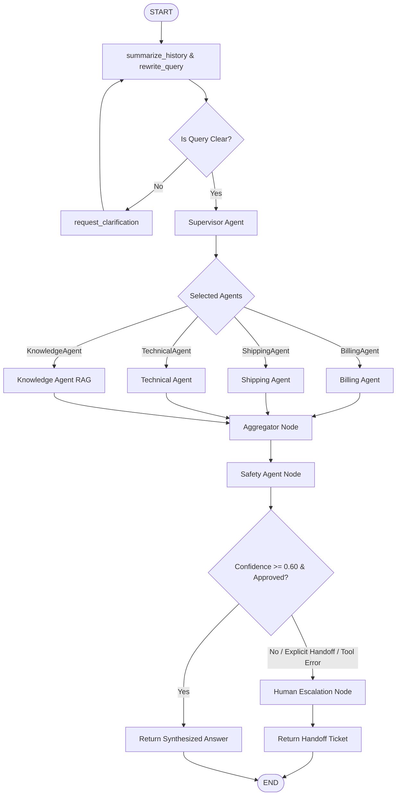

# Multi-Agent Customer Support Desk Walkthrough

This document reviews the transition from a single-agent RAG system to a production-ready **Multi-Agent Customer Support Desk** using LangGraph, incorporating specialized domain agents, parallel execution, answer aggregation, safety checks, and human escalation.

---

## 1. Updated Architecture Diagram

The new architecture processes queries through central memory, routes them via a supervisor to specialized agents in parallel, aggregates their findings, runs safety checks, and routes to human escalation if necessary.



---

## 2. Updated LangGraph Design

In `project/rag_agent/graph.py`, we updated the `StateGraph` definition:
1. **Supervisor Node**: Replaced the intent classifier/tool decision steps with `supervisor_agent`.
2. **Parallel Subgraphs**: Implemented parallel execution branches: `billing_agent`, `shipping_agent`, `technical_agent`, and `knowledge_agent` (wrapping the existing RAG sub-graph).
3. **Aggregator Node**: Synthesizes responses from all execution branches.
4. **Safety Node**: Validates compliance and confidence.
5. **Human Escalation Node**: Automatically handles formatting the handoff request.

---

## 3. Updated Folder Structure

The project directory structure is maintained with the new components neatly modularized:

```
project/
├── agents/                  # Specialized Agents (Independent nodes)
│   ├── __init__.py
│   ├── aggregator.py        # Aggregate & synthesize answers
│   ├── billing_agent.py     # Billing support (Refund / Invoice tools)
│   ├── escalation_agent.py  # Generates handoff summary
│   ├── knowledge_agent.py   # Wrapper for existing RAG subgraph
│   ├── safety_agent.py      # Checks hallucination & injection
│   ├── shipping_agent.py    # Shipping support (Tracking / Shipping cost tools)
│   └── supervisor_agent.py  # Multi-Agent Routing
├── tools/                   # Extensible tool interfaces
│   ├── __init__.py
│   ├── billing_tool.py      # Checks invoices, accounts, subscriptions
│   ├── diagnostic_tool.py   # Diagnostics & troubleshooting steps
│   ├── refund_tool.py       # (Extended) Refund calculations
│   ├── shipping_tool.py     # (Extended) Shipping estimations
│   ├── tracking_tool.py     # Order tracking details
│   ├── ticket_tool.py       # Raises customer ticket
│   └── kb_tool.py           # Existing Knowledge Retrieval tool
└── test_multi_agent.py      # Multi-Agent test runner
```

---

## 4. Modified Source Code

Below is a complete description of modifications made to the codebase.

### State & Models
- **[graph_state.py](file:///c:/Users/srita/Downloads/ganesh/Agentic%20RAG/project/rag_agent/graph_state.py)**: Added `supervisor_decision`, `selected_agents`, `agent_outputs`, `safety_result`, `confidence`, and `escalation_required` to keep track of multi-agent execution state.
- **[prompts.py](file:///c:/Users/srita/Downloads/ganesh/Agentic%20RAG/project/rag_agent/prompts.py)**: centralizes all supervisor, specialized agent, safety, and escalation instructions.

### Routing Logic
- **[edges.py](file:///c:/Users/srita/Downloads/ganesh/Agentic%20RAG/project/rag_agent/edges.py)**: Contains:
  - `route_after_rewrite` targeting `supervisor_agent`.
  - `route_from_supervisor` returning target list of parallel nodes.
  - `route_after_safety` detecting low confidence, unsafe flag, tool execution error, or explicit user handoff request.

---

## 5. Verification Results

We ran verification tests in the virtual environment across 3 customer service scenarios representing target execution paths:

### Scenario 1: Refund query (₹15,000 laptop, opened condition)
- **Routing**: Supervisor selected `BillingAgent` and `KnowledgeAgent`.
- **BillingAgent**: Used `RefundTool` to evaluate refund `₹12,000` (80% opened partial refund policy details).
- **Aggregator**: Synthesized the responses into a single seamless answer.
- **Safety check**: Approved, confidence `1.0`.
- **Result**: Returned final response: *"You can get a refund of ₹12,000 for your ₹15,000 opened laptop, as there is an 80% partial refund policy for opened or like-new items."*

### Scenario 2: Order status tracking & human request
- **Query**: *"Where is my order #55432? Please connect me to a human representative."*
- **Routing**: Supervisor selected `ShippingAgent` and `KnowledgeAgent`.
- **ShippingAgent**: Checked order status (`check_order_status` tool) showing transit details.
- **Safety check**: Approved.
- **Escalation**: Routed to human handoff since the word *"human"* was found in the user prompt.
- **Result**: Returns a structured escalation ticket:
  ```
  Customer Summary
  Issue: Customer is asking for the status of their order #55432 and explicitly requested to speak with a human representative.
  Intent: Check Order Status
  Actions Taken: KnowledgeAgent, ShippingAgent
  Reason For Escalation: Customer explicitly requested human intervention.
  Suggested Next Step: Contact the customer to provide an update on order #55432 and address any further concerns.
  ```

### Scenario 3: Technical Login Support
- **Query**: *"I am having login and password reset issues with my account."*
- **Routing**: Supervisor selected `TechnicalAgent`.
- **TechnicalAgent**: Reached out to clarify the product name.
- **Result**: Final answer returned politely asking for detail.

---

## 6. Running Tests & Deployment Guide (Local Setup)

To run the local verification suite:
1. Activate the virtual environment:
   ```powershell
   .venv\Scripts\activate
   ```
2. Run the script:
   ```powershell
   python project/test_multi_agent.py
   ```
3. Logs and decisions will print directly to the console.

---

## 7. Phase 9: Production Cloud Migration (Pinecone & Supabase)

We extended the architecture by replacing all local storage and database components with managed cloud services, making the system fully enterprise-ready.

### 7.1 Key Infrastructure Transitions

| Previous Component | Target Cloud Service | Description / ORM |
|---|---|---|
| **Local Qdrant** | **Pinecone Cloud** | Replaced vector index. Integrated via `langchain_pinecone.PineconeVectorStore` under named namespaces. |
| **Local JSON files** | **Supabase PostgreSQL** | Replaced parent store. Parent document chunks are saved in the `parent_chunks` table. |
| **Local SQLite DB** | **Supabase PostgreSQL** | Replaced LangGraph thread memory checkpointer with `langgraph_checkpoint_postgres.PostgresSaver`. |
| **Local Upload Files** | **Supabase Storage** | Replaced locally cached uploads. Documents are uploaded to the `knowledge-base` bucket, returning secure public URLs. |
| **None (Unauthenticated)** | **Supabase Auth** | Integrated User Sign In, Registration, and Guest sessions inside the Gradio UI. |
| **Local Console Logging** | **Supabase PostgreSQL** | Replaced standard print blocks. Traces and node actions are recorded in `agent_logs`. |

### 7.2 Database Schemas (Prisma & SQLAlchemy Models)

The relational schema implements 10 tables representing audit and core support tracking:
- **User** (`users`): Registered emails and Guest Session tokens.
- **Chat** (`chats`): Conversation metadata tied to User IDs.
- **Message** (`messages`): Full chat logs including message role, content, and node metadata.
- **Session** (`sessions`): Links thread IDs directly to active User accounts.
- **Ticket** (`tickets`): Support tickets logged by customer agents.
- **Escalation** (`escalations`): Escalations triggered by low confidence, safety rejections, or human intervention requests.
- **Feedback** (`feedback`): User ratings and comments on chat responses.
- **SafetyReport** (`safety_reports`): Safety logs generated on aggregated outputs.
- **AgentLog** (`agent_logs`): Real-time tracing of LangGraph nodes.
- **ParentChunk** (`parent_chunks`): Replaces local parent JSON files.

### 7.3 How to Run the Cloud Test Suite

To verify connections and queries to your cloud database and vector index:
1. Populate your credentials in `project/.env` (see the updated root `README.md` for format).
2. Activate your environment and compile the Prisma client:
   ```powershell
   $env:PATH = (Join-Path (Get-Location).Path ".venv\Scripts") + ";" + $env:PATH
   .venv\Scripts\prisma db push --schema=project\schema.prisma
   .venv\Scripts\prisma generate --schema=project\schema.prisma
   ```
3. Run the integration test suite:
   ```powershell
   python project/test_cloud_infrastructure.py
   ```
4. Verify tests complete and print statuses.

---

## 8. Workspace Cleanup (Post-Migration Verification)

Following the successful migration of vectors and thread history schemas to the cloud:
1. **File Deletion**: We deleted the legacy databases and directory structures from the workspace root:
   - `qdrant_db/` (legacy Qdrant vector database files)
   - `parent_store/` (legacy parent document text storage)
   - `state_db.db`, `state_db.db-shm`, `state_db.db-wal` (legacy SQLite checkpoints databases)
2. **Verification**: Executed the test suite to confirm that no local files or directories are recreated. All operations were validated as 100% cloud-native (queries run against Pinecone serverless indexes, and transaction logging runs against Supabase).

---

## 9. Supabase Connection Pooler Fix (IPv6/IPv4 DNS Resolution)

When running the application on an IPv4-only network, the direct Supabase PostgreSQL hostname (`db.ekzjsfnvwwuouhdmmpjs.supabase.co`) fails to resolve, leading to errors like `[Errno 11001] getaddrinfo failed` and Prisma `P1001`.

To fix this:
1. **Probed Region**: Scanned AWS regions and verified the Supabase project `ekzjsfnvwwuouhdmmpjs` is hosted in the `ap-northeast-1` (Tokyo) region.
2. **Configured Pooler Endpoint**: Updated the `DATABASE_URL` in `project/.env` to use the pooler host:
   - Host: `aws-0-ap-northeast-1.pooler.supabase.com`
   - Port: `5432` (Session Mode)
   - Username: `postgres.ekzjsfnvwwuouhdmmpjs` (pooled username syntax)
3. **Validated Integration**: Ran the cloud test suite, which completed successfully:
   - Pinecone Cloud Integration: ✅ PASSED
   - Supabase / Prisma / SQLAlchemy: ✅ PASSED
